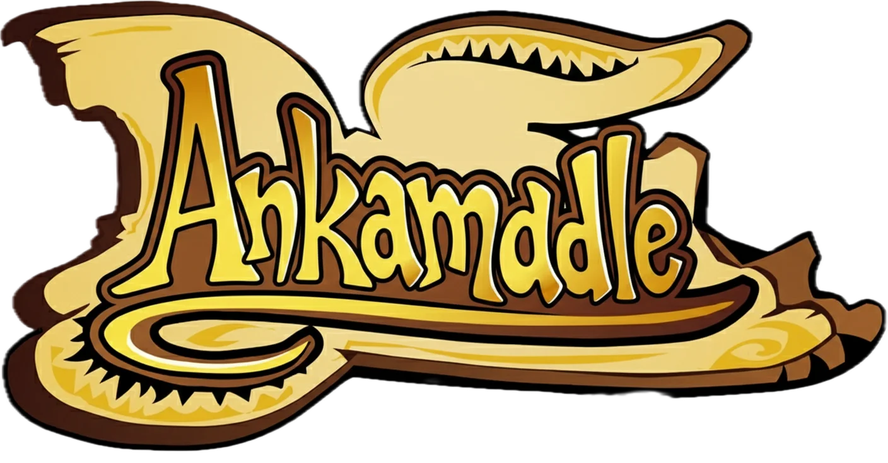

<p align="center">
  
</p>

<p align="center">
  A daily Wordle-style guessing game for Dofus Retro 1.29 monsters.<br>
  One monster per day. Same for everyone. How many guesses will you need?
</p>

<p align="center">
  <a href="https://dofusdle.fr">Play now</a> •
  <a href="#how-to-play">How to Play</a> •
  <a href="#features">Features</a> •
  <a href="#development">Development</a> •
  <a href="#credits">Credits</a>
</p>

## 🎮 How to Play

Each day, a mystery monster from **Dofus Retro 1.29** is selected. Guess which one it is by typing monster names into the search bar.

After each guess, you get feedback on **5 attributes**:

| Attribute | Feedback |
|-----------|----------|
| **Ecosystem** | 🟩 Correct or 🟥 Wrong |
| **Race** | 🟩 Correct or 🟥 Wrong |
| **Max Level** | 🟩 Exact, 🟧 Within ±10, or 🟥 Far off — with ↑/↓ arrows |
| **Color** | 🟩 Exact, 🟧 Partially matching, or 🟥 No match |
| **Max HP** | 🟩 Exact, 🟧 Within ±20%, or 🟥 Far off — with ↑/↓ arrows |

Stuck? After a few wrong guesses, **hints** unlock progressively: the monster's image preview and its ecosystem name.

The puzzle resets every day at **midnight Paris time**.

## ✨ Features

- **605 monsters** from the Dofus Retro 1.29 bestiary
- **Deterministic daily puzzle** — same monster for all players, powered by a seeded PRNG with a 30-day anti-repeat window
- **Fuzzy search** with autocomplete and monster images
- **Progressive hints** to help you narrow it down
- **Stats tracking** — win rate, current streak, max streak, and guess distribution persisted in localStorage
- **Emoji share** — copy your result grid to share with friends without spoilers
- **Yesterday's answer** displayed after the first guess
- **Fully client-side** — no backend, no accounts, no tracking. Just a static SPA.
- **Mobile-friendly** — responsive layout that works on any screen size

## 🛠 Tech Stack

| | |
|---|---|
| **Framework** | React 19 + TypeScript |
| **Build** | Vite |
| **Linting** | Biome |
| **Testing** | Vitest + React Testing Library |
| **Search** | fzf (fuzzy finder) |
| **Effects** | canvas-confetti |

No backend. No database. Fully static — deploy anywhere.

## 💻 Development

### Prerequisites

- Node.js 20+
- npm

### Setup

```bash
git clone https://github.com/mlz11/dofusdle.git
cd dofusdle
npm install
npm run dev
```

The dev server starts at [http://localhost:5173](http://localhost:5173).

### Commands

| Command | Description |
|---------|-------------|
| `npm run dev` | Start dev server |
| `npm run build` | TypeScript check + production build |
| `npm run preview` | Preview production build |
| `npm run test` | Run tests |
| `npm run test:watch` | Run tests in watch mode |
| `npm run lint` | Lint check (Biome) |
| `npm run lint:fix` | Auto-fix lint issues |
| `npm run format` | Format all files |
| `npm run typecheck` | TypeScript check (app + tests) |

### Project Structure

```
src/
  components/
    DofusRetro/        # Game mode (future modes get their own directory)
      Game.tsx          # Main game state & orchestration
      SearchBar.tsx     # Fuzzy autocomplete with keyboard navigation
      GuessGrid.tsx     # Renders guess results with flip animations
      Victory.tsx       # Win modal with stats and emoji share
      HintPanel.tsx     # Progressive hint reveals
  utils/
    daily.ts            # Deterministic daily monster selection
    compare.ts          # Guess comparison & feedback logic
    storage.ts          # localStorage persistence
  data/
    monsters.json       # Full monster database (605 entries)
  types.ts              # TypeScript interfaces
```

### Conventions

- **Commits**: [Conventional Commits](https://www.conventionalcommits.org/) enforced via commitlint
- **Formatting**: Biome with tab indentation and double quotes
- **Dependencies**: Exact versions only (no `^` or `~`)
- **Git hooks**: Pre-commit runs lint, commit-msg validates format

## ❓ FAQ

<details>
<summary><strong>Why only Dofus Retro 1.29?</strong></summary>

Dofus Retro has a well-defined, stable bestiary that doesn't change frequently — perfect for a daily guessing game. The component structure is organized under `DofusRetro/` to allow future game modes for other Ankama titles.

</details>

<details>
<summary><strong>How is the daily monster chosen?</strong></summary>

A deterministic hash of today's date (Paris timezone) seeds a PRNG that picks from the monster pool. The same seed always produces the same monster, so all players get the same puzzle. A 30-day anti-repeat window prevents the same monster from appearing too frequently.

</details>

<details>
<summary><strong>Is my data stored anywhere?</strong></summary>

Everything stays in your browser's localStorage. No data is sent to any server. Your stats, streaks, and daily progress are fully local.

</details>

## 🙏 Credits

- **[Ankama](https://www.ankama.com/)** — Dofus is their creation. This project is a fan-made tribute, not affiliated with Ankama.
- **[solomonk.fr](https://solomonk.fr/)** and **[wiki-dofus.eu](https://wiki-dofus.eu/)** — Monster data sources.
- Inspired by [Wordle](https://www.nytimes.com/games/wordle) and [LoLdle](https://loldle.net/).
